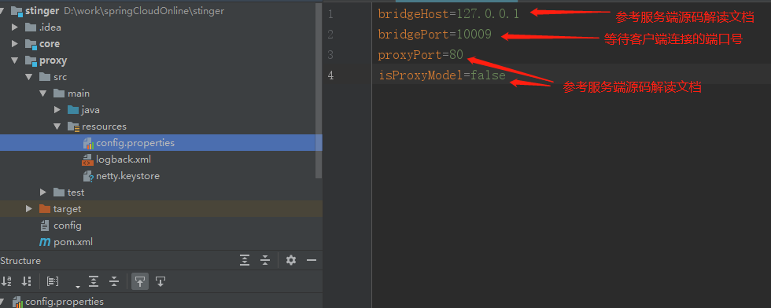
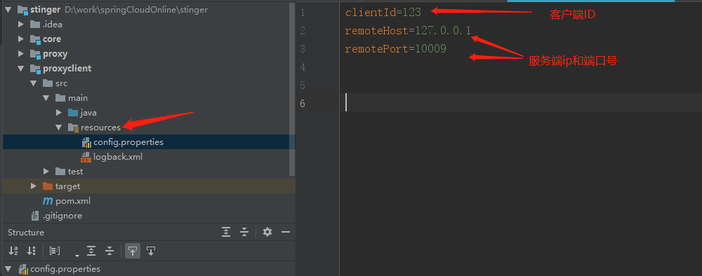

##  如何导入项目？
* 先通过git拉取代码  
git clone https://gitee.com/haojiangbo/venomous_sting.git 
* 导入idea或者eclise, 如何导入代码， [请自行百度 O(∩_∩)O~~]
## 如何运行项目


* **第一步** 找到proxy模块根目录下的config文件
* **第二步** 配置服务端端口号

* **第三步** 启动服务端
先按照第一步的配置，配置成功后，找到proxy模块start包目录下面的StartProxyServerApp.java 启动main函数即可
* **第四步** 配置客户端

* **第五步** 启动客户端
先按照第四步的配置，配置成功后，找到proxyclient模块start包目录下面的ClientAppStart.java 启动main函数即可

## 如何使用 cli  使用命令行的方式 操作 config（路由表）
```
java -jar proxyServer.jar cli  #启动 cli
目前只支持 list  get set del  flush exit 这几条命令
list 命令 查看 当前所有路由表
get 命令  get <clientId> 查看某一个clientId的路由表 例如   get abc
set 命令  set <clientId> <field> <value>  设置路由表中具体的属性 比如 set abc port  999 
del 命令  del <clientId> 删除路由表中的某一条记录
flush 命令  使 当前路由表 立即生效
exit 退出当前客户端
```
我已经在看云上写好了文档，
请点击下方连接查看文档，
详细配置会在此文档同步
https://www.kancloud.cn/haojiangbo/stinger
 