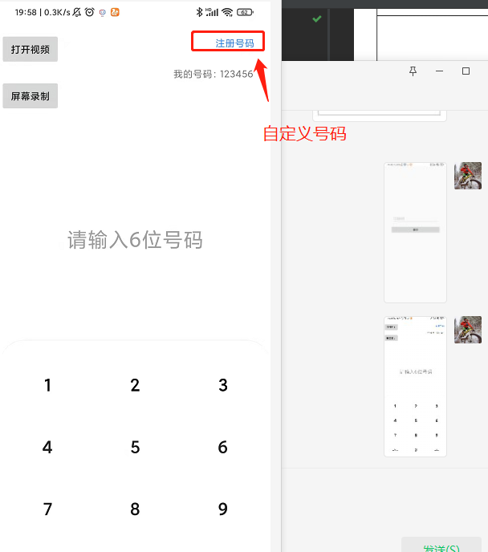

## 项目简介

- 该项目实现了简单的音视频通话的功能，
- 通过自定义6位电话号码呼叫对方
- 通讯协议是自定义的，只是为了学习方便，并未按照标准通讯协议去实现

## 服务端代码
-  https://gitee.com/haojiangbo/hummingbird.git server 分支

##使用教程

执行 server 端 UdpServerApp 的 main 方法 启动服务端

修改安卓项目中 NettyKeyConfig 中的 ip 地址为当前运行环境的ip地址

打开app 注册自己的号码

输入对方号码呼叫

